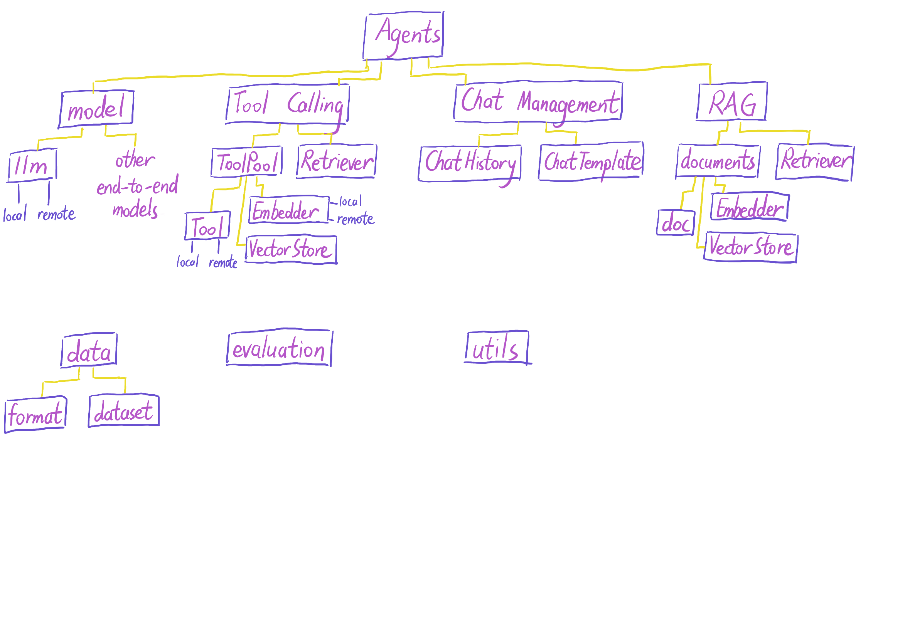

# Open Tool Learning


A LLM Function Calling Tool-kit for Tool Learning research.

## Contents

- [Ⅰ Support](##Ⅰ-support)
- [Ⅱ Architecture](##Ⅱ-architecture)
- [Ⅲ Format](##Ⅲ-format)
- [Ⅳ Code Catalog](##Ⅳ-code-catalog)

## Ⅰ Support

### LLM

`LLaMA`

### Dataset


### Retriever

## Ⅱ Architecture




## Ⅲ Format

### Tool Format

```python
{
    "name": "get_current_temperature",
    "description": "Get the current temperature for a specific location",
    "parameters": 
    {
          "type": "object",
          "properties": 
           {
            "location": {
              "type": "string",
              "description": "The city and state, e.g., San Francisco, CA"
            },
            "unit": {
              "type": "string",
              "enum": ["Celsius", "Fahrenheit"],
              "description": "The temperature unit to use. Infer this from the user's location."
            }
     },
     "required": ["location", "unit"]
}
```

### Chat Template


## Ⅳ Code Catalog

### agent

core class

### chat

chat history and chat template

### data

data preprocessing，load

### document

extra document process module for RAG

### LLM

foundation model

### process

format the answer text, ...

### retrieval

### tool

tool_pool information and execution

### types

type checking

### utils

logging , file io

